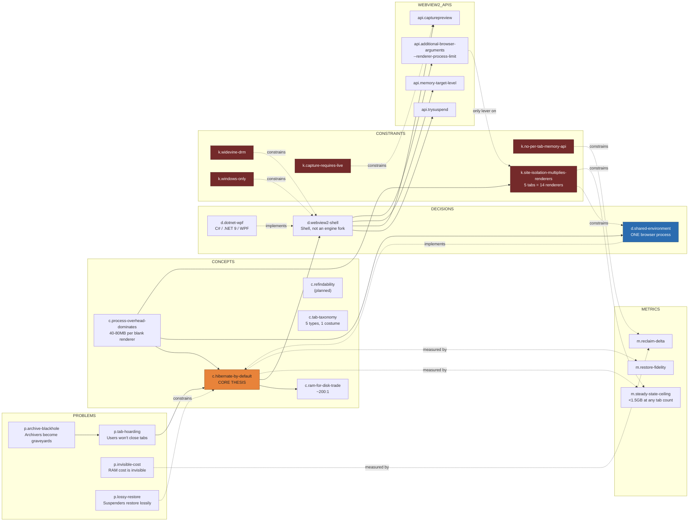
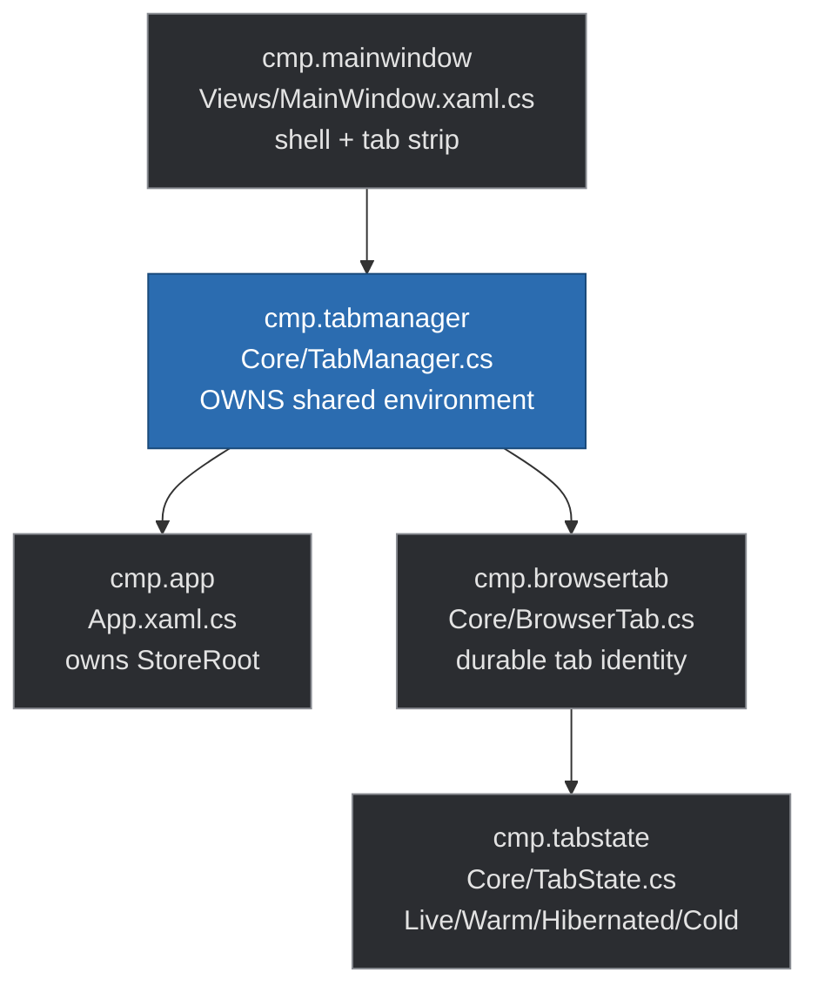

# Hearth Knowledge Graph

This is the human-readable rendering of [`knowledge-graph.json`](knowledge-graph.json), which is the
authoritative machine-readable source. **If the two disagree, the JSON wins.**

## Why this file exists

Source code records *what* a system does. It does not record why it is shaped that way, which
alternatives were considered and rejected, or which constraints are immovable. That reasoning
normally lives in a person's head and evaporates.

This graph is the durable form of that reasoning, written so that an AI agent picking up the
project cold can answer:

- Why is there exactly one `CoreWebView2Environment`? *(→ `d.shared-environment`)*
- Why not just fork Firefox? *(→ `d.webview2-shell`, `revisit_if`)*
- Why capture the screenshot on blur rather than on evict? *(→ `k.capture-requires-live`)*
- What breaks if I raise the live-tab budget? *(→ `c.process-overhead-dominates`)*

## How agents should use it

1. **Read before proposing architecture changes.** Nodes of type `decision` carry `rationale`
   and `revisit_if`. If your proposal does not clear the `revisit_if` bar, it has already been
   considered and rejected.
2. **Treat `constraint` nodes as immovable.** They encode platform and licensing limits, not
   preferences. `k.capture-requires-live` is a property of WebView2, not a design choice.
3. **Never violate an `invariant` field.** These are load-bearing.
4. **Update the graph in the same commit as the code.** A feature whose nodes are missing is
   invisible to the next agent.
5. **Reference nodes by `id` in commit messages and PRs.** IDs are stable; labels may be reworded.

## The graph

## Measured baseline (commit `0002`)

Taken **before** any budget or eviction exists — this is the curve the project has to flatten,
not a result.

| Tabs | Browser processes | Renderers | Total working set |
| ---: | ---: | ---: | ---: |
| 1 | 1 | 1 | 304.5 MB |
| 5 | 1 | **14** | 1170.3 MB |

The browser-process count staying at 1 confirms `d.shared-environment`. The renderer count
outrunning the tab count 14:5 is `k.site-isolation-multiplies-renderers` — cross-origin iframes
each get their own renderer. At ~234 MB/tab, naive extrapolation to 100 tabs exceeds 20 GB, which
is currently *worse* than Chrome.

## Component map

`TabManager` is highlighted because it holds the `d.shared-environment` invariant: it is the only
component permitted to call `EnsureCoreWebView2Async`, and it always passes the one environment it
owns. Environment ownership moved here from `MainWindow` in commit `0002`.

## Node index

| id | type | one-line |
| --- | --- | --- |
| `p.tab-hoarding` | problem | Refusing to close tabs is rational, not user error |
| `p.invisible-cost` | problem | Users feel slowness but don't attribute it to the browser |
| `p.lossy-restore` | problem | Lossy restore makes users disable suspenders |
| `p.archive-blackhole` | problem | Nobody revisits a OneTab list |
| `c.process-overhead-dominates` | concept | Tab count, not page weight, drives cost |
| `c.hibernate-by-default` | concept | **Core thesis** — live is a budgeted exception |
| `c.ram-for-disk-trade` | concept | ~150 KB disk replaces 40–80 MB RAM |
| `c.refindability` | concept | Evict aggressively only what's easy to get back |
| `c.tab-taxonomy` | concept | Five data types wearing one UI costume |
| `d.webview2-shell` | decision | Shell on WebView2, not an engine fork |
| `d.dotnet-wpf` | decision | C# / .NET 9 / WPF host |
| `d.shared-environment` | decision | One environment ⇒ one browser process |
| `k.no-per-tab-memory-api` | constraint | Per-tab memory must be inferred, not queried |
| `k.widevine-drm` | constraint | DRM needs a licence, not code |
| `k.windows-only` | constraint | WebView2 is Windows-only in practice |
| `k.capture-requires-live` | constraint | Screenshot on blur, never after evict |
| `k.site-isolation-multiplies-renderers` | constraint | 5 tabs produced 14 renderers; capping tabs ≠ capping renderers |
| `api.trysuspend` | api | Hibernation tier 1 |
| `api.capturepreview` | api | Visual placeholder source |
| `api.memory-target-level` | api | Cheap intermediate tier |
| `api.additional-browser-arguments` | api | Only embedder lever on the process model |
| `cmp.tabmanager` | component | Owns the shared environment — the load-bearing invariant |
| `cmp.browsertab` | component | Tab identity that outlives its renderer |
| `cmp.tabstate` | component | Four-state lifecycle enum |
| `m.steady-state-ceiling` | metric | Flat working set as tabs grow |
| `m.restore-fidelity` | metric | Users must not feel eviction |
| `m.reclaim-delta` | metric | Bytes returned per eviction |
