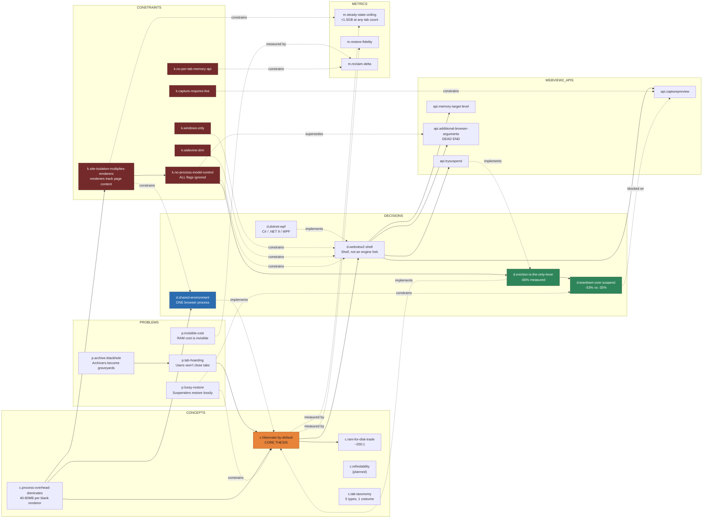
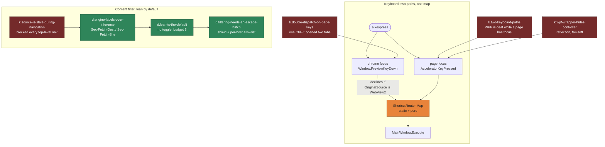
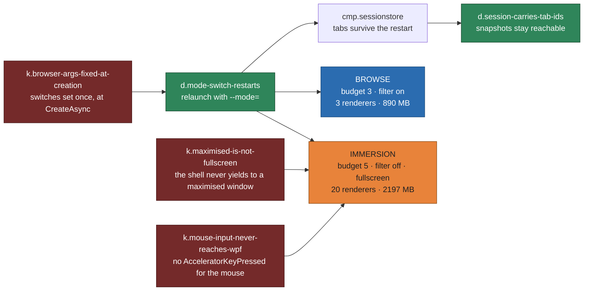
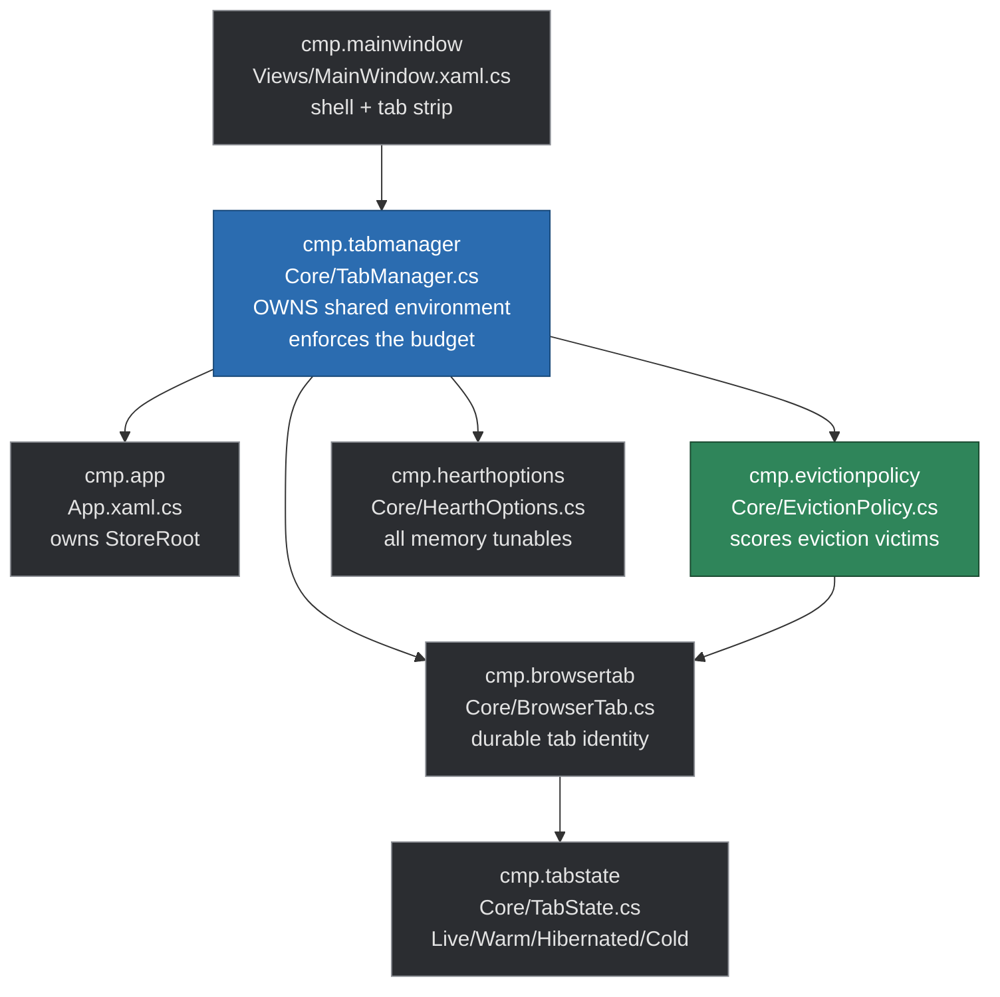

# Hearth Knowledge Graph

This is the human-readable rendering of [`knowledge-graph.json`](knowledge-graph.json), which is the
authoritative machine-readable source. **If the two disagree, the JSON wins.**

> **Browsing by hand?** Open [`knowledge-graph.html`](knowledge-graph.html) — an interactive
> force-directed view of the same data, with filtering, search, and a record panel showing each
> node's rationale, invariants and relationships. Single self-contained file, no build step, no
> network access. Double-click it.

## Why this file exists

Source code records *what* a system does. It does not record why it is shaped that way, which
alternatives were considered and rejected, or which constraints are immovable. That reasoning
normally lives in a person's head and evaporates.

This graph is the durable form of that reasoning, written so that an AI agent picking up the
project cold can answer:

- Why is there exactly one `CoreWebView2Environment`? *(→ `d.shared-environment`)*
- Why not just fork Firefox? *(→ `d.webview2-shell`, `revisit_if`)*
- Why capture the screenshot on blur rather than on evict? *(→ `k.capture-requires-live`)*
- What breaks if I raise the live-tab budget? *(→ `c.process-overhead-dominates`)*

## How agents should use it

1. **Read before proposing architecture changes.** Nodes of type `decision` carry `rationale`
   and `revisit_if`. If your proposal does not clear the `revisit_if` bar, it has already been
   considered and rejected.
2. **Treat `constraint` nodes as immovable.** They encode platform and licensing limits, not
   preferences. `k.capture-requires-live` is a property of WebView2, not a design choice.
3. **Never violate an `invariant` field.** These are load-bearing.
4. **Update the graph in the same commit as the code.** A feature whose nodes are missing is
   invisible to the next agent.
5. **Reference nodes by `id` in commit messages and PRs.** IDs are stable; labels may be reworded.

## The graph

## Input and defaults (commit `0008`)

Two findings that are invisible in the source and expensive to rediscover.

`Map` is highlighted for the same reason `TabManager` is below: it holds an invariant. Both paths
must resolve through it, and a second key-to-command table anywhere in the codebase is a bug.

### Filtering as a default (commit `0008`)

One tab on `stackoverflow.com`, one Debug build, 90 s settle, only `HEARTH_BLOCK_FRAMES` varying:

| Configuration | Renderers | Total | |
| --- | ---: | ---: | ---: |
| filtering on (default) | **1** | **719 MB** | **−55%** |
| filtering off *(control)* | 14 | 1599 MB | — |
| after granting the site via the shield | 14 | 1.6 GB | — |

Absolute figures are **not** comparable with `0005`'s: this is a Debug build and includes Hearth's
own WPF process. The within-run control is what the claim rests on.

## Modes (commit `0009`)

Six real sites, every tab activated so the budget binds, one Debug build, 95 s settle:

| Mode | Renderers | Total |
| --- | ---: | ---: |
| browse | 3 | 890 MB |
| immersion | 20 | **2197 MB** |

**Immersion costs about 2.5x browse**, which is why it is entered deliberately. The thesis was never
that memory does not matter — it is that the user should decide when to spend it and be able to see
what they spent (`m.immersion-cost`).

## Measured results (commit `0003`)

Eight real sites, every tab activated so the budget binds:

| Configuration | Renderers | Total | Reduction |
| --- | ---: | ---: | ---: |
| budget=8 (no eviction) | 21 | 1823 MB | — |
| budget=3, `TrySuspend` | 10 | 1188 MB | −35% |
| budget=3, full teardown | 5 | 854 MB | −53% |
| budget=1, full teardown | 2 | 628 MB | −66% |

Budget fixed at 3, tab count varied — the flatness claim:

| Tabs | Renderers | Total |
| ---: | ---: | ---: |
| 4 | 3 | 752 MB |
| 8 | 5 | 911 MB |
| 16 | 3 | **548 MB** |

Sixteen tabs cost less than four. Memory is decoupled from tab count (`c.hibernate-by-default`
validated). Residual variance is which pages are live at sample time, not how many tabs exist.

### Retraction

Commit `0002` claimed ~234 MB/tab extrapolating past 20 GB at 100 tabs. **Retracted.** That run
had one live tab, not five — only the last startup URL is activated — so 14 renderers and 1170 MB
belonged to stackoverflow.com alone. Cold tabs cost nothing: 5× stackoverflow measured identically
to 1×. Always report live tab count beside open tab count.

### Dead end

No Chromium process-model switch has any effect through WebView2 (`k.no-process-model-control`).
`--renderer-process-limit=4`, `--process-per-site`, and both together all produced exactly 14
renderers on the same page, with the flag verified present in the browser process command line.
Eviction is the only lever that exists here.

## Component map

`TabManager` is highlighted because it holds the `d.shared-environment` invariant: it is the only
component permitted to call `EnsureCoreWebView2Async`, and it always passes the one environment it
owns. Environment ownership moved here from `MainWindow` in commit `0002`.

## Node index

<!-- GENERATED: node index below is rebuilt from knowledge-graph.json. -->

**85 nodes, 189 edges**, current to commit `0011`. This table is generated from the JSON; edit the JSON, never this table.

### Problems (4)

| id | one-line |
| --- | --- |
| `p.tab-hoarding` | People keep 100-500 tabs open because the tab strip is the only place where 'things I still care about' remain visible. Refusing to close is a... |
| `p.invisible-cost` | Users experience the symptom (a slow machine) but do not attribute it to the browser. Because the cost is never made legible, there is no pressure to... |
| `p.lossy-restore` | Chrome Memory Saver, The Great Suspender and similar tools lose scroll position, form state and media timestamps on restore. The papercut causes... |
| `p.archive-blackhole` | OneTab, Session Buddy and Toby convert a visible anxious pile into an invisible list nobody revisits. Users intuit this and resist adoption... |

### Concepts (5)

| id | one-line |
| --- | --- |
| `c.process-overhead-dominates` | Any memory strategy that does not reduce the number of live renderers is treating a symptom. |
| `c.tab-taxonomy` | Active work, a todo, a reference doc, a read-later item, and a fear-of-loss artifact all wear the same UI costume. Applying one lifecycle policy to... |
| `c.refindability` | How hard a tab would be to recover if closed. A homepage or Wikipedia article is trivially refindable; a filtered dashboard view, a deep search... |
| `c.ram-for-disk-trade` | Disk cost is effectively free at any realistic tab count. 1,000 hibernated tabs would occupy roughly 27 MB. There is no reason to ration snapshots or... |
| `c.hibernate-by-default` **[core thesis]** | Every other browser treats loaded as default and unloading as an emergency. Chrome Memory Saver and Firefox tab unloading are REACTIVE, triggering... |

### Decisions (19)

| id | one-line |
| --- | --- |
| `d.webview2-shell` | De-risk the product thesis on the cheap substrate first. If screenshot-backed restore does not feel convincing here, a Gecko fork inherits the same... |
| `d.dotnet-wpf` | Chosen partly by environment: .NET 9 SDK and VS 2022 present, no Rust toolchain installed. WinUI3 was rejected for packaging friction. |
| `d.shared-environment` | Never call EnsureCoreWebView2Async without passing the shared environment. |
| `d.content-blocking-is-the-indirect-lever` | This is the answer to k.no-process-model-control and it closes the loop opened in 0003. Every Chromium switch was ignored; a content filter moved... |
| `d.eviction-is-the-only-lever` | Measured: eviction alone cut memory 35% (TrySuspend) to 66% (full teardown) at a fixed 8-tab workload, while every process-model flag produced no... |
| `d.teardown-over-suspend` | TrySuspend is worth keeping as the fast-resume tier for recently-blurred tabs, but it cannot carry the memory promise on its own. |
| `d.tokenised-theming` | Both dictionaries must expose exactly the same keys. A key present in one and missing from the other resolves to nothing after a swap and paints... |
| `d.bigpicture-exit-hibernates` | Leaving the wall is the clearest signal available that the user surveyed everything and picked one thing. Waiting for some later activation to push... |
| `d.bigpicture-is-budget-one` | The lean-back aesthetic and the memory architecture want the same thing here, which is the reason the mode is worth having rather than being a skin.... |
| `d.lean-is-the-default` | c.hibernate-by-default says hibernated is a tab's default state. A browser that only honours that once the user finds a toggle does not hold the... |
| `d.filtering-needs-an-escape-hatch` | Filtering can only be a default if a user who hits a broken login has an explanation and a remedy in the same place. A permanently visible badge is... |
| `d.engine-labels-over-inference` | Chromium computes these on every request and they depend on no state the embedder has to keep correct. The URL-comparison version needed Source to be... |
| `d.mode-switch-restarts` | Forced by k.browser-args-fixed-at-creation. The honest alternative was not 'switch modes live' -- that is unavailable -- but 'ship a mode that... |
| `d.session-carries-tab-ids` | Snapshots are keyed by tab id. Restoring with fresh ids would orphan every screenshot the previous run captured -- still on disk, permanently... |
| `d.immersion-evicts-by-recency` | 'The last few in the chain' is a different question from 'what is worth keeping'. Habit weighting is right for a working session -- a reference doc... |
| `d.grid-inherits-the-mode` | One layout, two correct results, and no mode check in the XAML. Up to 0009 the grid forced the window to maximise, so opening it resized the browser... |
| `d.single-click-opens` | This was the single biggest reason the grid read as broken. Nothing else in this app, and no tab switcher anyone has used, needs two clicks to pick a... |
| `d.zoom-connects-card-to-page` | The transition should make the page you land on visibly the card you chose. A cut, or a plain crossfade, leaves the user to re-establish where they... |
| `d.address-bar-follows-the-tab` | Guarding on focus alone was wrong because focus SURVIVES a tab switch: Ctrl+T focuses the bar, and every switch after that (Ctrl+Tab, Ctrl+1... |

### Constraints (immovable) (19)

| id | one-line |
| --- | --- |
| `k.no-per-tab-memory-api` | Neither WebView2 nor Chromium exposes per-renderer memory to embedders. Per-tab cost must be inferred by measuring the reclaim delta across a... |
| `k.widevine-drm` | Netflix, Spotify and Prime need Widevine. WebView2 inherits Edge's Widevine support, but a shipped product needs a licence relationship with Google.... |
| `k.windows-only` | WebView2 targets Windows. Cross-platform would require CEF, Tauri's wry, or a per-OS webview abstraction. |
| `k.capture-requires-live` | A tab restored from a cold session has no screenshot until it has been live once. |
| `k.site-isolation-multiplies-renderers` | A shared environment guarantees one BROWSER process, not one renderer per tab. Capping live tabs alone does not cap renderers; ad-heavy or... |
| `k.no-process-model-control` | Renderer count is a function of page content alone. The ONLY memory lever available to a WebView2 embedder is reducing the number of live tabs --... |
| `k.frame-blocking-breaks-pages` | Through 0007 this is why it was a MODE and not a default. Since 0008 it IS the default, which is only defensible because... |
| `k.custom-chrome-maximise` | Removing the native title bar is not free. The first build hid the memory readout behind the taskbar whenever the window was maximised -- the readout... |
| `k.powershell-utf8-corruption` | This shipped a visible UI bug -- the Big Picture subtitle rendered as '6 open A. one stays awake'. A blanket Latin-1 to UTF-8 repair then made it... |
| `k.wpf-airspace` | Any full-window UI in this app must COLLAPSE the WebView2 host rather than stack above it. There is no Z-order fix. |
| `k.capture-needs-first-paint` | Capture is gated on BrowserTab.HasRendered, set from a successful NavigationCompleted and cleared on teardown. A refused capture correctly also... |
| `k.two-keyboard-paths` | ShortcutRouter.Map is static and pure, and is the only place a key becomes a command. |
| `k.wpf-wrapper-hides-controller` | Page-level keyboard handling requires reflection. It is cached once per process and fail-soft: a failed lookup degrades shortcuts to chrome-only and... |
| `k.double-dispatch-on-page-keys` | The chrome path must decline any keystroke that originated in web content, but only while the native hook is known to be working. |
| `k.source-is-stale-during-navigation` | This shipped in 0005 and was invisible for three commits, because filtering could only be engaged mid-session -- by which time a page had committed... |
| `k.browser-args-fixed-at-creation` | Any setting expressed as a Chromium switch cannot be changed in a running process. This is why switching modes RESTARTS Hearth rather than... |
| `k.maximised-is-not-fullscreen` | Real fullscreen is WindowState.Normal, Topmost, sized explicitly to the monitor in DIPs. MaximiseFix.Fullscreen does this; the WM_GETMINMAXINFO hook... |
| `k.mouse-input-never-reaches-wpf` | Pointer gestures can only be recognised inside the page, by an injected listener posting through window.chrome.webview. |
| `k.collapsed-host-blocks-initialisation` | MainWindow.RestoreShell runs, including a forced UpdateLayout, before any activation triggered from the grid. |

### WebView2 APIs (4)

| id | one-line |
| --- | --- |
| `api.additional-browser-arguments` | Passes raw Chromium command-line switches to the browser process at environment-creation time. The only route to process-model control from an... |
| `api.trysuspend` | Suspends a WebView2, freeing significant renderer memory while keeping the controller alive for fast resume. Requires the controller to be invisible... |
| `api.capturepreview` | Captures the visible content of a WebView2 to a PNG or JPEG stream. Used to produce the visual placeholder that makes an evicted tab... |
| `api.memory-target-level` | Hints to the runtime that a WebView2 should minimise memory usage. Cheaper and lower-fidelity than TrySuspend; usable as an intermediate tier for... |

### Metrics (5)

| id | one-line |
| --- | --- |
| `m.steady-state-ceiling` | Target: total working set stays flat as tab count grows. Reference points: Chrome at 100 tabs is 6-10 GB, Firefox 2-4 GB. Hearth target is under 1.5... |
| `m.restore-fidelity` | Whether a rehydrated tab returns to the same scroll offset, form state and media position. The product thesis fails if users can feel eviction... |
| `m.reclaim-delta` | Working-set bytes returned to the OS by evicting one tab. Doubles as the per-tab cost estimate that makes the invisible cost legible to users. |
| `m.filtering-reclaim` | One tab on stackoverflow.com, one Debug build, 90 s settle, only HEARTH_BLOCK_FRAMES varying. Filtering on: 1 renderer / 719 MB. Filtering off... |
| `m.immersion-cost` | Six real sites, every tab activated so the budget binds, one Debug build, 95 s settle. Browse: 3 renderers / 890 MB. Immersion: 20 renderers / 2197... |

### Components (18)

| id | one-line |
| --- | --- |
| `cmp.app` | Application entry point. Owns StoreRoot, the single on-disk location for the WebView2 user-data folder, hibernation screenshots and the session index. |
| `cmp.mainwindow` | Application shell. At commit 0001 it hosts a single WebView2 and creates the shared environment, proving the toolchain. Becomes the tab-strip host in... |
| `cmp.tabstate` | Four-state lifecycle enum (Live, Warm, Hibernated, Cold). Ordered so that a higher value means cheaper to hold and slower to restore; eviction always... |
| `cmp.browsertab` | Null View must never be treated as an error condition. Tabs are documents; renderers are a cache. |
| `cmp.tabmanager` | RealiseAsync is the ONLY place permitted to call EnsureCoreWebView2Async, and it always passes the shared environment. |
| `cmp.thememanager` | The token dictionary is always slot 0 of MergedDictionaries; it is replaced in place so styles declared after it keep resolving. |
| `cmp.maximisefix` | Hooks WM_GETMINMAXINFO so a custom-chrome window maximises to the work area instead of over the taskbar. Resolves the monitor per-window for... |
| `cmp.snapshotconverter` | Decoding full-resolution page captures for dozens of thumbnails would spend more memory on the tab overview than on the tabs, which would be an... |
| `cmp.memoryprobe` | Never display a memory number this process has not actually observed. The project's argument is that the cost is real; a fabricated figure forfeits... |
| `cmp.snapshotstore` | Capture only ever happens at blur, on the outgoing tab, before any visibility change. Never write the capture stream straight to a file -- buffer it... |
| `cmp.hearthoptions` | All memory tunables in one record, with environment-variable overrides so configurations can be A/B tested from a script without rebuilding. Gathered... |
| `cmp.evictionpolicy` | Scores live tabs worst-first. Recency decays as 1/(1+idleMinutes) and is weighted by log(1+activationCount), so a reference doc reopened twenty times... |
| `cmp.shortcutrouter` | Map is static and pure. Both paths must resolve through it; a second key-to-command table anywhere is a bug. |
| `cmp.siterules` | This is the component that makes filtering-by-default defensible rather than merely aggressive. |
| `cmp.diag` | 0008's central claim -- that a keystroke landing on a page reaches the shell -- cannot be checked by reading code or looking at the window, because... |
| `cmp.modeprofile` | Mode is fixed for the lifetime of the process. Anything that wants to vary it must go through App.RestartInto. |
| `cmp.sessionstore` | Exists to make d.mode-switch-restarts affordable. A browser that loses your tabs when you change a setting is one nobody changes the setting on. |
| `cmp.gesturescript` | The only place a pointer gesture can be recognised, per k.mouse-input-never-reaches-wpf. |

### Commits (11)

| id | one-line |
| --- | --- |
| `commit.0001` | Repo initialised, WPF + WebView2 shell builds and navigates, documentation and knowledge-graph structure established. |
| `commit.0002` | Tab abstraction and TabManager introduced; environment ownership moved out of the window. Verified one browser process across 5 tabs, and discovered... |
| `commit.0003` | Live-tab budget with score-based eviction. Established that no Chromium process-model flag has any effect through WebView2, that eviction is... |
| `commit.0007` | Native title bar removed and the tab strip became the caption; full light/dark token theming following Windows; animated hover, selection and mode... |
| `commit.0006` | Full-screen, keyboard-driven wall of tab snapshots with the live budget pinned to one. Discovered the WPF airspace constraint and the... |
| `commit.0005` | Replaced the developer status strip with a real taskbar: navigation, a measured memory readout in plain language, and a low-power toggle. Low power... |
| `commit.0004` | Snapshot capture at blur, scroll replay on restore, placeholder painting during rebuild, and teardown enabled by default gated on holding a snapshot.... |
| `commit.0008` | Browser keyboard shortcuts wired on both delivery paths and verified through the real OS input stack; low-power toggle removed and lean made the... |
| `commit.0009` | Immersion added as the opposite pole to browse: real device fullscreen, generous recency-chain budget, filtering off, GPU and anti-throttling... |
| `commit.0010` | Found and fixed the reason picking a tab from the grid hung: activation was started while the content host was still collapsed. Grid no longer... |
| `commit.0011` | The address bar no longer keeps showing the previous tab's URL after a switch made while it had keyboard focus. |
